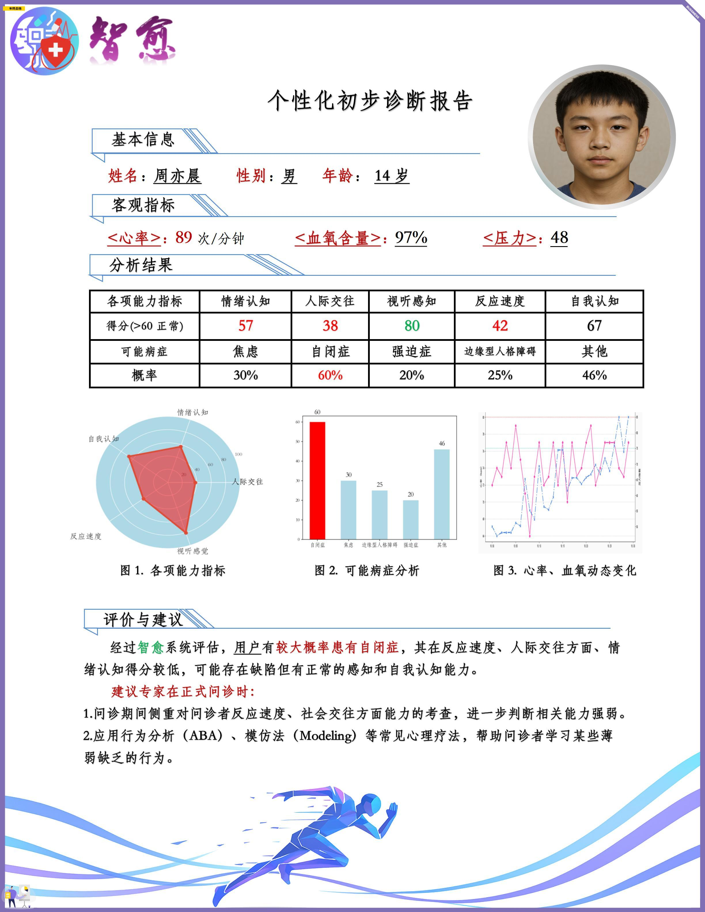

# 快速开始

## 环境准备
首先创建一个虚拟环境，然后安装环境依赖。
```bash
# 安装依赖
pip install -r requirements.txt
```

## 数据集下载
数据集来源：

- [文本数据集](https://huggingface.co/datasets/mavinsao/reddit-mental-illness-82)
- [图像数据集1](https://huggingface.co/datasets/Jasmer/sentiment_dataset)
- [图像数据集2](https://huggingface.co/datasets/AllenTAN/image_sentiment)
```bash
# 下载数据集,图像数据集可根据自己需求选择下载
huggingface-cli download --repo-type dataset --resume-download mavinsao/reddit-mental-illness-82 --local-dir /your_path/Dataset

huggingface-cli download --repo-type dataset --resume-download Jasmer/sentiment_dataset --local-dir /your_path/Dataset
```
## 模型下载与加载
```python
from modelscope import snapshot_download, AutoTokenizer
from transformers import TrainingArguments, Trainer, DataCollatorForSeq2Seq, Qwen2VLForConditionalGeneration, AutoProcessor
import torch

# 在 modelscope上下载Qwen2-VL模型到本地目录下
model_dir = snapshot_download("Qwen/Qwen2-VL-7B-Instruct", cache_dir="/your_path/Model")

# 使用Transformers加载模型权重
tokenizer = AutoTokenizer.from_pretrained("./Qwen/Qwen2-VL-7B-Instruct/", use_fast=False, trust_remote_code=True)
# 特别的，Qwen2-VL-7B-Instruct模型需要使用Qwen2VLForConditionalGeneration来加载
model = Qwen2VLForConditionalGeneration.from_pretrained("./Qwen/Qwen2-VL-7B-Instruct/", device_map="auto", torch_dtype=torch.bfloat16, trust_remote_code=True,)
model.enable_input_require_grads()  # 开启梯度检查点时，要执行该方法
```

## 模型微调
模型微调的代码文件已经提供，可以直接运行。
```bash
# 运行微调代码
python train_model.py
```

## 模型推理
模型推理的代码文件已经提供，可以直接运行。
```bash
# 运行推理代码
python inference.py
```

如果暂时无法进行模型训练与推理，我们提供了API调用方式，可以通过更改LVLM.py文件中的API_KEY参数与model类型来调用API。
然后运行LVLM.py文件即可。
```bash
# 运行API调用代码
python LVLM.py
```

## 报告生成
```bash
cd report

# 运行报告生成代码
python report.py
```

## 结果展示
最终报告如下图所示


