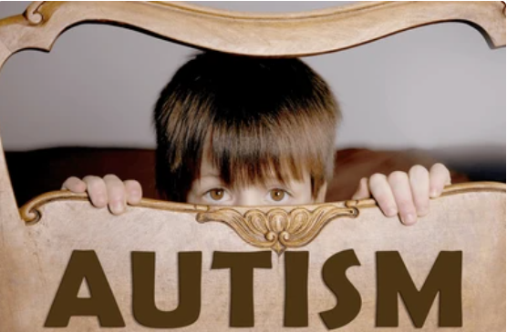
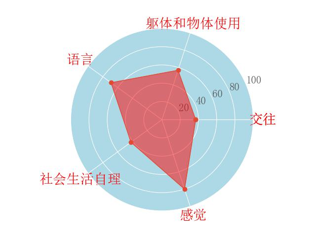
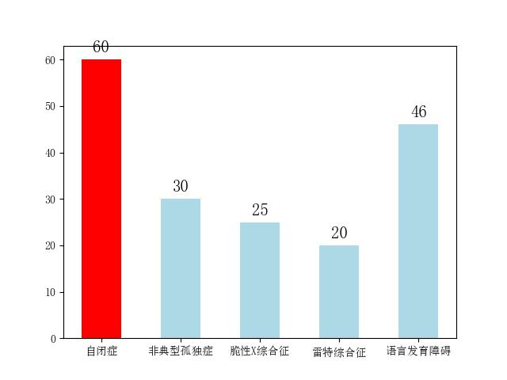

# 诊断报告
## 基本信息

【患者姓名】：小明

【患者性别】：男

【患者年龄】：约5-7岁

## 客观表现
【行为表现】：从图片中可以看出，小明躲在椅子后面，眼神显得有些紧张或不安，可能表现出一定的社交回避行为。

【心率】：89

【血氧含量】：99%

## 能力指标

|  Option  | 躯体和物体使用 | 交往  |  感觉  |  社会生活自理   | 语言  |
|:--------:|:-------:|:---:|:----:|:---------:|:---:|
|  score   |   35    | 50  |  60  |    48     | 60  |

## 能力指标

|  Option  | 躯体和物体使用 | 交往  |  感觉  |  社会生活自理   | 语言  |
|:--------:|:-------:|:---:|:----:|:---------:|:---:|
|  score   |   35    | 50  |  60  |    48     | 75  |

## 可能病症
|  Option  | 自闭症 | 非典型孤独症 |  脆性X综合征 |  雷特综合征   | 语言发育障碍  |
|:--------:|:-------:|:---:|:----:|:---------:|:---:|
|  score   | 80      | 20  | 10   |    5      | 10  |

【初步判断】：根据小明的能力指标得分和行为表现，他可能患有自闭症。特别是他的躯体和物体使用、交往和社会生活自理能力得分较低，而语言能力相对较高，这与自闭症的特征相符。

## 可能病症
【初步判断】：根据提供的信息和图片中的行为表现，小明可能存在自闭症的某些特征，如社交回避、语言和交往能力的不足等。

## 建议与评价
【建议】：
1. **专业评估**：建议尽快带小明到专业的医疗机构进行全面的评估和诊断。
2. **心理支持**：提供适当的心理支持和辅导，帮助小明缓解焦虑和情绪问题。
3. **家庭环境**：创造一个稳定、安全的家庭环境，鼓励小明参与家庭活动，增强安全感。
4. **教育干预**：考虑早期的教育干预措施，如应用行为分析（ABA）等，以促进小明的社会交往能力和语言发展。